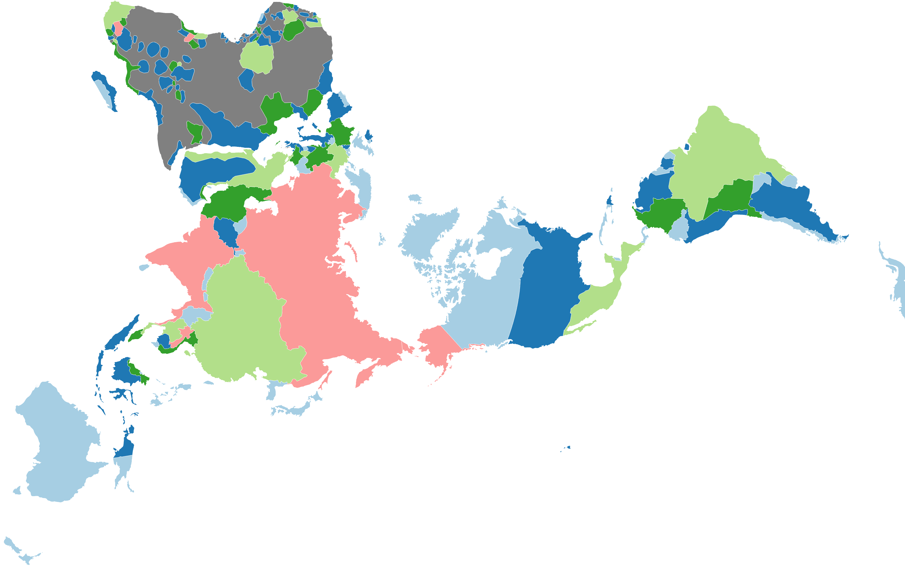
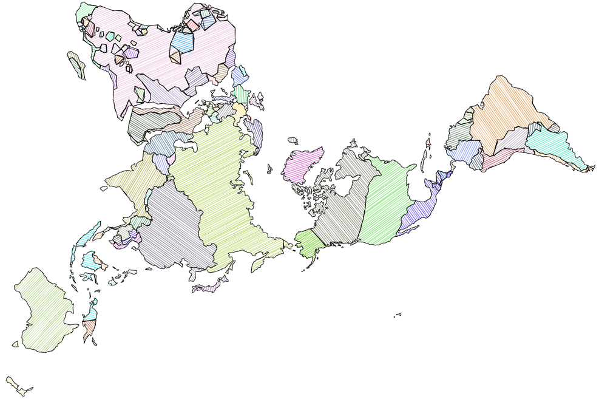

# Historical boundaries of world countries and cultural regions

This historical boundaries project aims at providing ready-to-use base maps for mapping historical data. As a vast, epoch-specific historical knowledge is required to make these files more reliable, this project is open to all contributions. Please do not hesitate to fork this repository and file pull requests.

## GeoJSON

All maps are stored in the _geojson_ format in the /geojson/ folder: single file per feature layer, human and machine readable, easy to import in [qGIS](https://github.com/qgis/QGIS) or use in [D3](https://github.com/d3) (see [d3example.html](d3example.html) written for D3v4 and [d3v5example.html](d3v5example.html) for D3v5, as well as [d3v5_roughjs_example.html](d3v5_roughjs_example.html) with the additional use of [rough.js](https://github.com/pshihn/rough)).

The file called _places.geojson_ contains locations of cities and other settlements. At this point, it is only a draft and needs your help for completion. Places throughout history can be added to this single file. When used, it can be filtered by the `inhabitedSince` and `inhabitedUntil` columns.

Geodata precision of polygone features in other files is adapted for mapping data on world/continent scale.

## SVG

The SVG maps (/svg/ folder) are the result of a conversion of GeoJSON files with the R sript _geojson2svg.Rmd_. The script uses a "Natural Earth" projection.

Please see these SVG files only as raw material editable with a vector drawing software for the needs of GIS non-savy users. If you contribute to this Git repository, please edit directly the GeoJSON files.

## Conceptual limitations and disputed territories

When using the data, keep in mind that

1. historical boundaries are even more disputed than contemporary ones, that
2. the actual concept of territory and national boundary becomes meaningful, in Europe, only since the [Peace of Westphalia](https://en.wikipedia.org/wiki/Peace_of_Westphalia) (1648), that
3. areas of civilizations actually overlap, especially in ancient history, and that
4. overlaying these ancient vector maps on contemporary physical maps can be misleading; rivers, lakes, shorelines _do_ change very much over millenia; think for instance about the evolution of the [Aral sea](https://en.wikipedia.org/wiki/Aral_Sea) since the 1980s.

Overlapping areas are useally dealt with as topological errors in traditional GIS, but some overlaps make sense in the case of this repository.
Also, an interesting GIS question is how to map fuzzy borders of regions of decreasing inflience, as would apply to Antiquity. Certainly a field to investigate...

## Projection

The geodata are stored in the WGS 84 projection, EPSG:4326 (crs:OGC:1.3:CRS84). Coordinates are in LatLon, the projection is geographical. Consider reprojecting to show the maps on world scale, choosing a [projection with minimal area distortion](https://bl.ocks.org/syntagmatic/ba569633d51ebec6ec6e), such as the __Dymaxion__ projection in the first example or the __Molweide__ projection. Most mapping software and algorithms reproject on the fly.

## Contributing

You are welcome to contribute by making your forks and filing pull requests.

### Deontology

When editing, please consider that the primary purpose of this repository is to facilitate mapping historical regions. There are, today, many examples of disputed territories. Contemporary India, for instance, has [territorial disputes with China, Pakistan and Nepal](https://en.wikipedia.org/wiki/List_of_disputed_territories_of_India). A solution could be to draw the borders of the India polygon as perceived / recognized by the Indian governement, leaving the polygons of the surrounding countrieds intact (i.e. as perceived by the governments of those countries). In this manner, overlaps could help to identify disputed regions. I hope such issues can be solved in a diplomatic manner, like they have been between India and Bangladesh in 2015 or India and Sri Lanka in 1974.

### Practical aspects

When correcting the geometries of individual geojson files, please make sure that:

1. You don't introduce topological errors (gaps and overlaps, unless overlaps signify disputed borders). The QGIS plugin called _Digitizing Tools_ is particularly helpful to carve out a region out of an axisting polygon with the tool "Cut with selected polygons"...
2. Boundaries that have not moved between two or more successive files remain aligned. This will allow others to make animations. The multilayer topological editing tool in QGIS 3 might help you with that. 

Further notes on contributing in [CONTRIBUTING.md](CONTRIBUTING.md).

## Credits

This project started as a collection of basemaps collected, adpated and converted from diverse sources, sometimes only available through the wayback machine. Among these sources, anonymous students from the "ThinkQuest Team C006628".

## Some (rare) historical GIS resources on the web

* [GIS data : historical country boundaries](https://www.gislounge.com/find-gis-data-historical-country-boundaries/)
* [CShapes by Niels Weidman](http://nils.weidmann.ws/projects/cshapes.html), also available as an R package.
* [Ancient World Mapping Center at the University of orth Carolina](http://awmc.unc.edu/wordpress/map-files/)
* [Geacron.com](http://geacron.com). A nice tool, but commercial, with no possibility to extract polygons for use in a GIS.
* [Atlas of Human Evolution](http://atlasofhumanevolution.com/). A very nice tool, for the prehistory of the Homo species.
* [Old Maps Online](https://www.oldmapsonline.org/en/Hokkaido).
* [Native Land](https://native-land.ca). Contains notably maps of territorial conventions between colonizers and native populations in the Americas and Australia.

## Other resources - non-GIS or GIS files non-downladable

* [Wikimedia: Maps of the world showing history](https://commons.wikimedia.org/wiki/Category:Maps_of_the_world_showing_history)
* [Interactive World History Atlas since 3000 BC](http://geacron.com/home-en/). The commercial version of the program allows you to see the timeline.

## Spatial mutations in theory and fiction

* [Ourednik, A. (2010) _L'habitant et la cohabitation dans les modèles de l'espace habité_ (2010), EPFL.](https://ourednik.info/essais.php?texte=phd) (PhD thesis, in French) - on the notion of codwelling in space and time. Central topic: changing spatial ontologies (_i.e._ the type and extent of things in space).

* [Ourednik, A. (2014), _The impossible here_](https://www.espacestemps.net/articles/the-impossible-here/) (research paper) - "Grain upon grain, one by one, and one day, suddenly, there’s a heap, a little heap, the impossible heap."

* [Ourednik, A. (2015) _Les cartes du boyard Kraïenski_](https://ourednik.info/fictions.php?texte=boyard-kraienski) (novel, in French) -  a cartographer sent to map the eastern border or the European Union gets lost in a fictive country somewhere between Ukraine and Bulgaria...

If you edit the geojson maps and want to refer your own published work, please add here.
